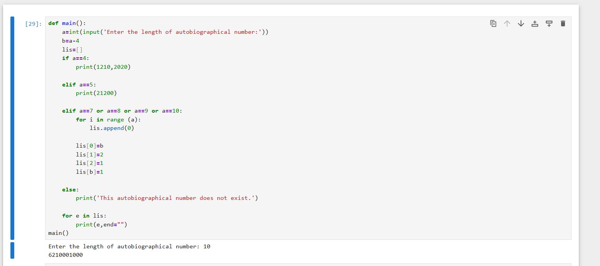
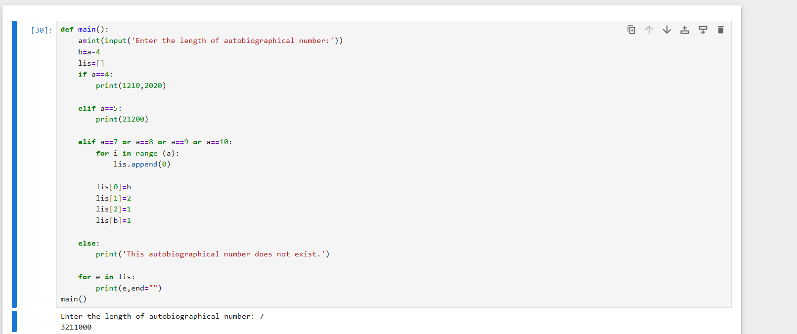
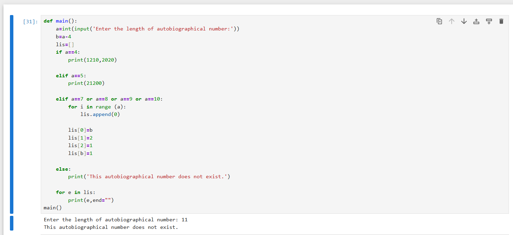

An autobiographical number is a number that describes its own digits.

For an n-digit number, the digit at position i tells you how many times the digit i occurs in the number.

Example

1210 is an autobiographical number because:

1 zero → there is 1 zero;  2 ones → there are 2 ones;  1 two → there is 1 two;  0 threes → there are 0 threes

Therefore, 1210 describes the frequency of each digit in itself.

Below is the code that generates an autobiographical number based on the length of the number entered by the user.

## Example Outputs

### Example 1

### Example 2

### Example 3

  
